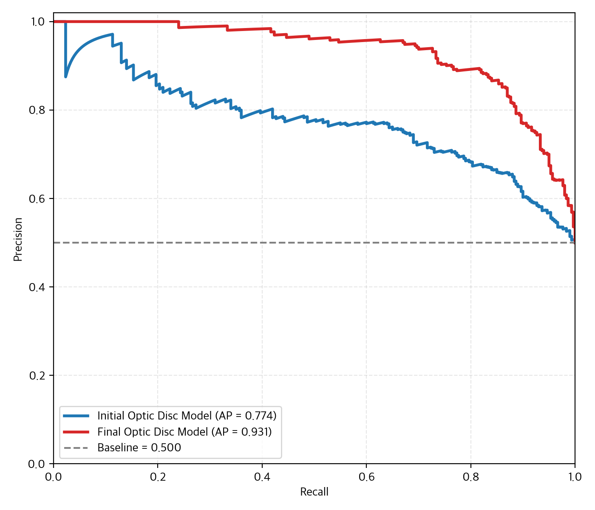
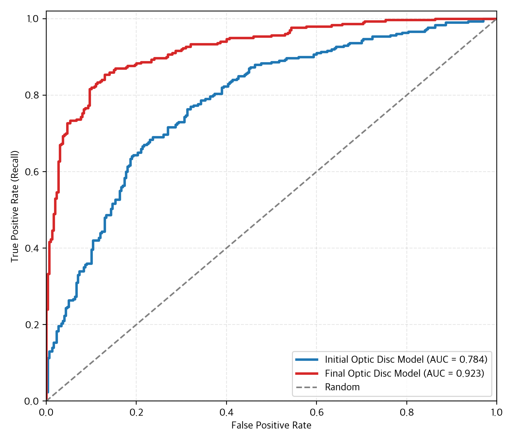
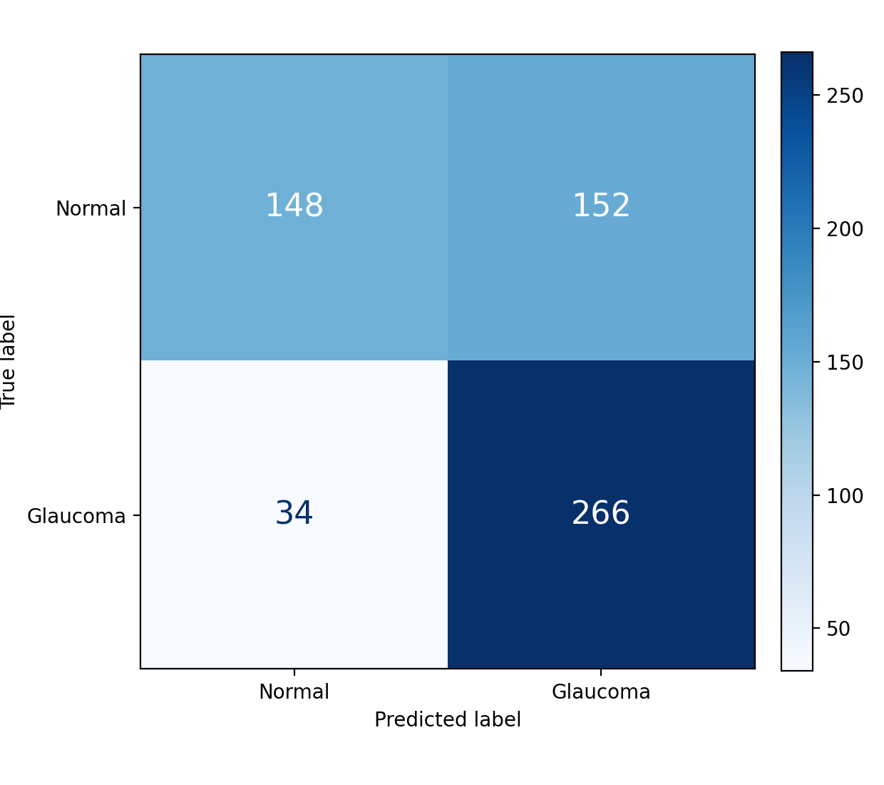
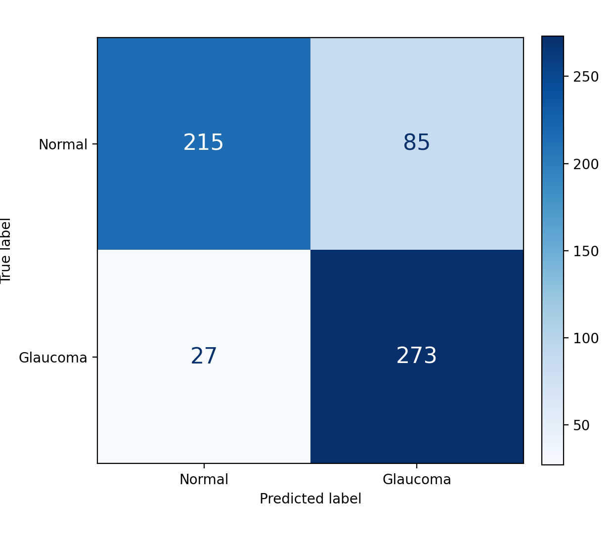
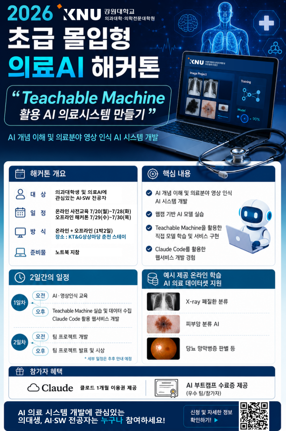

# 안저 이미지 전처리 기반 녹내장 분류

> 🏆 **2026 KNU 초급 몰입형 의료AI 해커톤 우수상 수상 프로젝트**

안저 이미지에서 시신경유두 영역을 자동으로 추출하고, Teachable Machine으로 학습한 모델을 웹에 연동해 정상과 녹내장 의심 이미지를 분류한 프로젝트입니다.

- 실제 제출 사이트: <https://webpage-qxuaq8izu-knu-med.vercel.app/>
- 대회: 2026 KNU 초급 몰입형 의료AI 해커톤
- 주최: 강원대학교 의과대학·의학전문대학원
- 수상: 우수상

> 이 프로젝트는 연구·교육용 프로토타입이며 의료 진단이나 전문 의료인의 판단을 대체하지 않습니다.

## 팀 구성 및 담당 역할

4인 팀으로 진행했으며, 역할을 다음과 같이 나누어 협업했습니다.

### 담당한 작업

- 팀원 1명과 함께 안저 이미지 전처리 수행
- 전처리 결과를 바탕으로 Teachable Machine 분류 모델 학습
- 정상·녹내장 이미지 클래스 구성 및 학습 과정 확인
- 최종 발표자료 검토 및 피드백

### 다른 팀원이 담당한 작업

- 웹 UI 구현
- Teachable Machine 모델과 웹페이지 연동
- Vercel 배포
- 최종 발표 진행

전처리는 2명이 공동으로 수행했으며, 본 프로젝트에서 담당한 핵심 역할은 **전처리된 학습 데이터 구성과 Teachable Machine 모델 학습**입니다.

## 프로젝트 핵심

모델 자체보다 **학습 전에 안저 이미지의 시신경유두 영역을 일관된 크기와 위치로 추출하는 전처리 과정**에 초점을 맞췄습니다.

원본 안저 이미지는 촬영 장비와 조건에 따라 검정 여백, 밝기, 크기 및 시신경유두 위치가 달라집니다. 전체 이미지를 그대로 학습할 경우 불필요한 배경과 위치 편차가 모델에 영향을 줄 수 있어, 규칙 기반 전처리로 관심 영역을 먼저 추출했습니다.

## 전처리 방법

`preprocessing.py`는 OpenCV와 NumPy만 사용하는 결정론적 전처리 코드입니다.

1. 가장 큰 비검정 연결 영역을 찾아 안저 촬영 영역을 검출합니다.
2. 다중 스케일 밝기, 국소 대비, 혈관 밀도를 계산합니다.
3. 다음 결합 점수가 가장 높은 위치를 시신경유두 중심으로 선택합니다.

```text
score = brightness + 0.8 × local_contrast + 0.6 × vessel_density
```

4. 검출된 안저 높이의 35% 크기로 정사각형 관심 영역을 추출합니다.
5. 경계 밖 영역은 검정색으로 패딩해 정사각형 비율을 유지합니다.
6. 결과 이미지를 512×512로 통일하고 좌표와 점수를 JSON으로 저장합니다.

자세한 설계 내용은 [`preprocessing-analysis.pdf`](docs/preprocessing-analysis.pdf)에서 확인할 수 있습니다.

## 모델 및 웹 구현

- Teachable Machine 이미지 분류 모델
- 클래스: `정상`, `녹내장`
- 입력 크기: 224×224
- Teachable Machine 2.4.14
- TensorFlow.js 1.7.4
- 이미지 업로드 및 미리보기
- 정상·녹내장 예측 확률 시각화

`index.html`, `assets/`, `model/`은 실제 Vercel 제출 사이트에서 복구한 배포 파일입니다. JavaScript는 빌드·압축된 번들이며 소스맵이 공개되지 않아 빌드 전 VS Code 원본 구조와 주석까지 복구된 코드는 아닙니다.

## 성능 평가

정상 300장과 녹내장 300장으로 구성된 600장의 평가 이미지에서 초기 모델과 최종 모델을 비교했습니다. 아래 정확도, 정밀도, 재현율과 F1은 보존된 혼동행렬을 기준으로 계산한 값입니다.

| 지표 | 초기 모델 | 최종 모델 |
|---|---:|---:|
| Accuracy | 69.0% | 81.3% |
| Glaucoma Precision | 63.6% | 76.3% |
| Glaucoma Recall | 88.7% | 91.0% |
| Glaucoma F1 | 74.1% | 83.0% |
| ROC AUC | 0.784 | 0.923 |
| Average Precision | 0.774 | 0.931 |

최종 모델은 초기 모델보다 정상 이미지를 녹내장으로 잘못 분류한 건수가 152건에서 85건으로 감소했습니다. 동시에 녹내장 재현율도 유지·개선되어 전체 정확도와 곡선 기반 지표가 함께 상승했습니다. 이 비교는 대회 과정에서 보존한 초기·최종 평가 결과이며, 개선 폭을 특정 단일 요인의 효과로만 해석하지 않습니다.

### Precision–Recall 및 ROC 비교

<p align="center">
  
  
</p>

### 혼동행렬 비교

<p align="center">
  
  
</p>

## 학습 데이터셋

모델 학습에는 Kaggle의 **SMDG, A Standardized Fundus Glaucoma Dataset (SMDG-19)**을 사용했습니다.

- 제공자: Riley Kiefer (`deathtrooper`)
- 데이터셋: [SMDG, A Standardized Fundus Glaucoma Dataset](https://www.kaggle.com/datasets/deathtrooper/multichannel-glaucoma-benchmark-dataset)
- DOI: [10.34740/KAGGLE/DS/2329670](https://doi.org/10.34740/KAGGLE/DS/2329670)
- 구성: 19개 공개 녹내장 데이터셋을 표준화한 안저 이미지 및 관련 메타데이터
- 분류 라벨: 비녹내장, 녹내장, 녹내장 의심

이 프로젝트에서는 안저 이미지를 정상과 녹내장 클래스로 구성해 학습에 사용했습니다. 데이터셋과 각 원천 데이터의 이용 조건을 존중하기 위해 원본 이미지와 가공 이미지는 이 저장소에 포함하지 않습니다. 재현 시 Kaggle에서 데이터를 직접 내려받고 데이터 카드와 원천 데이터별 라이선스를 확인해야 합니다.

### 데이터셋 인용

```bibtex
@dataset{smdg,
  title     = {SMDG, A Standardized Fundus Glaucoma Dataset},
  author    = {Riley Kiefer},
  publisher = {Kaggle},
  year      = {2023},
  doi       = {10.34740/KAGGLE/DS/2329670},
  url       = {https://www.kaggle.com/ds/2329670}
}
```

## 프로젝트 구조

```text
.
├── index.html              # 실제 제출 웹 앱 진입점
├── assets/                 # 배포된 JavaScript 및 CSS 번들
├── model/                  # Teachable Machine 모델과 메타데이터
├── preprocessing.py       # 대회 당시 안저 이미지 전처리
├── docs/
│   ├── competition-poster.png
│   ├── hackathon-presentation.pdf
│   ├── preprocessing-analysis.pdf
│   └── results/            # 초기·최종 모델 평가 그래프
└── README.md
```

원본 의료 이미지와 전처리 결과는 데이터 사용 및 재배포 조건을 고려해 Git 저장소에서 제외합니다.

## 실행 방법

### 제출 웹 앱

저장소 루트에서 정적 서버를 실행합니다.

```bash
python -m http.server 5500
```

브라우저에서 <http://127.0.0.1:5500>에 접속합니다. `file://`로 직접 열면 모델 로딩이 실패할 수 있습니다.

### 이미지 전처리

Python 환경에 NumPy와 OpenCV를 설치합니다.

```bash
python -m pip install numpy opencv-python
python preprocessing.py images --output-dir preprocessed_data
```

출력 폴더에는 512×512 관심 영역 이미지와 `crop_metadata.json`이 생성됩니다.

## 대회 포스터

<p align="center">
  
</p>

> 포스터의 신청 일정과 QR 코드는 현재 유효하지 않을 수 있습니다.

## 참고 자료

- [해커톤 발표자료](docs/hackathon-presentation.pdf)
- [전처리 코드 분석자료](docs/preprocessing-analysis.pdf)
- [SMDG-19 학습 데이터셋](https://www.kaggle.com/datasets/deathtrooper/multichannel-glaucoma-benchmark-dataset)
- [실제 제출 Vercel 사이트](https://webpage-qxuaq8izu-knu-med.vercel.app/)
